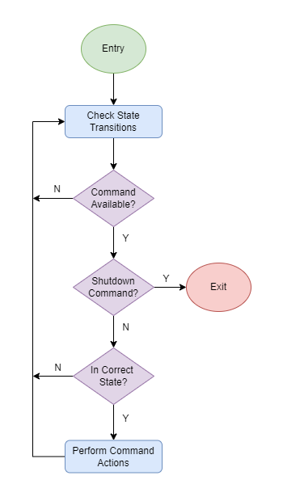

# Advanced Space Technical Assessment
This document and the related code included in this directory are dedicated to fulfilling the requirements of Advanced Space's technical assessment. The goal of the technical assessment is to design and develop two simple applications, a simulated flight software (FSW) and a simulated ground control software (GCS). This README serves the purpose of a report to discuss design decisions as well as show proper usage of the contained code.

## FSW Design
The FSW is a simple state machine with four states that symbolize different operating modes in a satellite system. Those states are Restarting, Ready, Safe Mode, and BBQ Mode. The roles of these states dare to determine which commands are valid for the FSW to process. These states transition into each other based on a variety of conditions. Restarting transitions to Ready after a 10 second delay immediately after FSW startup. During this time the software does not handle commands. Ready can transition to Safe Mode either by the FSW rejecting 5 invalid commands or by the SAFE_MODE_ENABLE command. Safe Mode can transition to BBQ Mode by rejecting a further 3 invalid commands or back to Ready with the SAFE_MODE_DISABLE command. Finally, BBQ mode can transition to Ready by the SAFE_MODE_DISABLE command. 

### Main Loop Logic

With these states in mind, the FSW was designed to have a very basic flow of checking the current state, and performing any state-specific actions (such as checking for transition criteria) and checking if there are any commands to process. This will take place in a semi-infinite loop to process any updates as they come in, but the loop will have an exit. The main logic for the execution loop is shown in the flowchart below.

The main loop execution frequency is bounded by a small timeout (20 ms) on the communication interface, meaning the main loop is not rapidly executing when there are no messages (freeing resources on the machine for other tasks).

### Commands

As mentioned previous, the FSW is supposed to take command from the GCS. The commands are as follows:
- "safe mode enable" will switch the FSW to safe mode. This command is invalid when in BBQ mode or in safe mode.
- "safe mode disable" will switch the FSW back to the ready state. This command is always valid.
- "show number of commands received" will return the total number of valid commands received since startup of the FSW. This command is invalid when in BBQ mode or in safe mode.
- "show number of safe modes" will return the number of times the FSW has switched to safe mode since startup. This command is invalid when in BBQ mode.
- "show up time" will return the number of seconds since the FSW was started. Developer may use the system clock to determine this information. This command is invalid when in BBQ mode or in safe mode.
- "reset command counter" will reset the command counter to zero and then return the number of commands received (i.e. zero). This command is invalid when in BBQ mode or in safe mode.
- "shutdown" will return the  state of the FSW, close the socket and stop the process. This command is always valid. (from the Assessment pdf)

### Binary Encoding of States and Commands

To best encode these commands and states into values, the states were assigned values of powers of two. This was to ensure that the states were represented, in binary, as a single one in a byte of zeros. The assigned values were Restarting - 1, Ready - 2, Safe - 4, BBQ - 8. The reason for this assignment was due to the how the commands were encoded to make it easier to check if a command was being used in a valid state. The commands were encoded by having the 4 most significant bits of a byte representing a generic 4-bit id (value from 0 to 15 in binary) to be the "id" of the command to ensure each command was unique from one another. The least significant half-byte of the command identifiers were bit fields to represent prohibited states, such that a command that was logically "and"ed with a prohibited state would return a nonzero value or would produce a value of zero with compared logically to an allowed state. This pattern was used to prevent an issue of repaeting code to verify the current state of the FSW when processing commands, in hopes of cleaner and more efficient code. The identifiers of the commands are as follows:
- SAFE_MODE_ENABLE    - 0b00001100 ("id" - 0, prohibited states - bbq and safe),
- SAFE_MODE_DISABLE   - 0b00010010 ("id" - 1, prohibite state - ready),
- NUM_CMDS_RECEIVED   - 0b00101100,
- NUM_SAFE_MODES      - 0b00111000,
- SHOW_UP_TIME        - 0b01001100,
- RESET_CMD_COUNT     - 0b01011100,
- SHUTDOWN            - 0b01100000

### Communication

The communication with the GCS is done over a simple UDP network. This approach was used to allow for the FSW to be agnostic of "client" connections, and for a simpler logical flow. The FSW uses port 8080 to recieve and send commands to clients, and is watching for connections on all available network adapters, meaning the process is not limited to only communications on a local host. 

Upon the receiving of a command, the FSW attempts to process the command and check if the command should be accepted or rejected. Commands are sent to the FSW as a single byte (values shown above), and the FSW responds to the sending client with a packet containing any response data from certain commands which return values to the GCS (NUM_CMDS_RECEIVED, NUM_SAFE_MODES, SHOW_UP_TIME), whether or not the command was accepted or rejected, and the current state of the FSW, in this order. This ordering allows for the state and status of acceptance to be knowably at the end, and all data recieved before that to parse as a returned integer value. The acceptance status byte allows for the GCS to know whether or not the FSW perofmed the action required, the most likely case for a command to be rejected is an incompatible state.

Of note: the FSW checks and transitions states before processing GCS commands, so if a command was rejected and causes the FSW to transition states, the transition will take place on the next iteration of the FSW loop, leading to the state reported being the state commanded to be transitioned to by command, or the state from which the FSW rejected a command.

## GCS Design

The GCS design is that of a basic user-exitable loop that will take the user's input from the command terminal and perform the specified action (sending the specified command, exiting, or listing the commands). The GCS design was kept simple as the GCS in this instance is a tool by which the behavior of the FSW is tested and made observable. Improvements of the GCS could include a graphical user interface that could allow for a better understanding of the current state of flight software and better allow for the expansion of the number and detail of FSW state machine and commands.

An invalid command is included in the commands available to the user of the GCS, this command is used to test the functionality of the FSW state machine.

The GCS uses UDP to send command messages to the FSW based on an IP address specified by the user. It then waits to recieve the response and parses it to understand the response of the FSW. If no message is recieved, the GCS will continue to its basic operation of waiting for user input to behave in the desired way. Before the command is sent, messages in queue for the GCS application are discarded to only parse data related tothe command to be sent.

Error handling was used to make the GCS reasonably robust to most issues that can be encountered, including socket timeouts, parsing errors, and type errors.

The GCS defaults to targetting port 8080 on the local host (127.0.0.1), but this can be specified when starting the application.

The GCS is agnostic of the state of the FSW, meaning the application will not exit if the FSW has been commanded to shutdown, to allow for the same instance of the GCS to target a restarted FSW. With the addition of a command to change IP targets, this would allow for one GCS to communicate to multiple instances of FSW.

## Build Instructions

The code was developed in a Linux Environment (WSL2 on Windows 10, Ubuntu 20.04.6) and uses some platform specific libraries in the C application. These paltform specific libraries are primarily used for establishing the UDP communications. The Linux environment was used out of developer familiarity and experience with the platform and associated libraries.

No external libraries should be necessary to build the code.

A Makefile is provided that is intended for Linux systems. The Makefile contains a target to build the FSW application and a clean target to remove the executable.

The software was compiled with gcc (Ubuntu 9.4.0), using the command `gcc -Wall -g -O0 src/fsw.c -o fsw` (`-Wall` turns on more warning linters, `-g` gives debug info, and `-O0` sets the minimum optimization, these flags are primarily used for a development build of software, and would be changed for a full release). This compilation can also be down by using `make` in  the top directory (same as this file). The resulting executable can be run simply by `./fsw`, which will cause the FSW to immediately launch and begin its execution.

The Python GCS does not need to be built, but is run by calling `python3 src/gcs.py` and following the prompts in the terminal.

## Example Usage

In one terminal, build and start the FSW, and, in a second terminal, run the GCS script. Follow the prompts in the GCS and wait for the FSW to enter its READY state, after which it will respond to commands. The commands can be sent from the GCS by typing in the number appearing beside them in the listing.

Some tests conducted to ensure proper functionality are, running both programs on Ubuntu machine (WSL2) and running through each command and checking various states and responses on both applications to make sure they are in alignment, testing the programs on differe machines (FSW on WSL2 and GCS on Windows 10) using the user input to target the IP of the other machine and testing commands, and sending commands from the GCS prioir to the FSW entering the READY mode to ensure the GCS stays in sync. 

## Future Improvements

Some future improvements of the FSW and GCS would be to swap to a TCP method of communciation that allows for connections to be verified and managed, as opposed to the agnostic approach, to let communications between the client and server have less possibility of falling out of sync. In addition, a more robust state machine could be made where mock telemetry or other actions are included into the different states, as opposed to the states only marginally controlling the commands available. Commands could be handled in Restarting mode. A CRC can be added to the end of messages to ensure the full message was recieved and check for noise in communication (more likely from space).

## Time Estimations

- FSW: 5 hours
- GCS: 3 hours
- Report: 2 hours